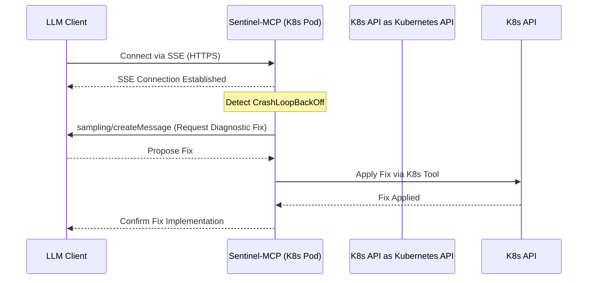

# Sentinel-MCP

Sentinel-MCP is a production-grade Model Context Protocol (MCP) server designed for high-scale Kubernetes environments. It demonstrates advanced "Level 3" MCP concepts.

## Core Architecture & Advanced Concepts

- **Transport Layer Security (TLS/SSE):** Supports authenticated SSE (Server-Sent Events) over HTTPS, allowing remote client connections instead of stdio.
- **Context Window Management (Semantic Resources):** Uses Resource Templates with "Semantic Compression" to pre-process and summarize data locally before sending it to the LLM.
- **Autonomous Error Recovery (Sampling):** Implements a 'Self-Healing' loop to query the LLM for diagnostic fixes via `sampling/createMessage` when a pod enters CrashLoopBackOff, applying the fix via a Kubernetes Tool.
- **K8s Integration:** Runs as a Deployment in Kubernetes with a ServiceAccount utilizing Least-Privilege RBAC.

## K8s-to-LLM Lifecycle

## Repository & DevOps Standards

- **Infrastructure as Code (IaC):** Contains a `/terraform` folder for provisioning infrastructure and a `/k8s/sentinel-mcp` folder with Helm charts.
- **Observability:** Integrates OpenTelemetry to trace every tool call with parent-child relationship logs.
- **Security Hardening:** Implements 'Roots' to restrict filesystem access and 'Rate Limiting' on the Sampling interface.
- **CI/CD:** GitHub Actions workflow for linting (`ruff`), testing (`pytest`), and building a multi-arch Docker image.

## Setup

1. Install `uv` (see https://docs.astral.sh/uv/getting-started/installation/)
2. Install dependencies: `make install`
3. Run server: `make run`
4. Run tests: `make test`
